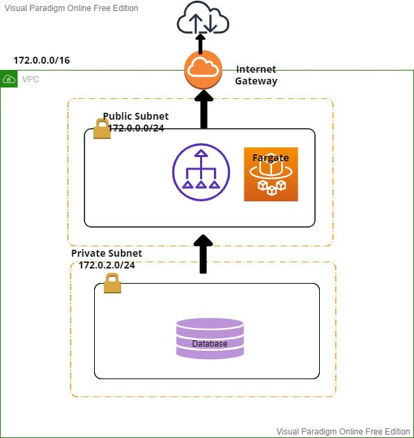
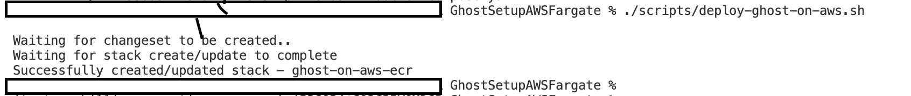
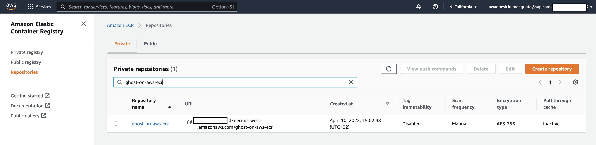
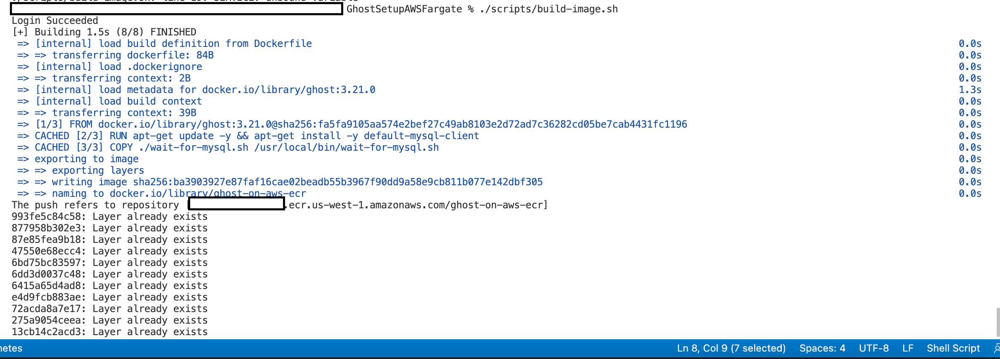
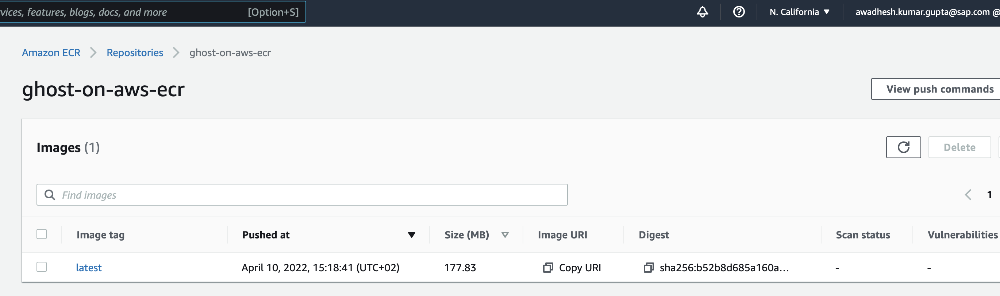
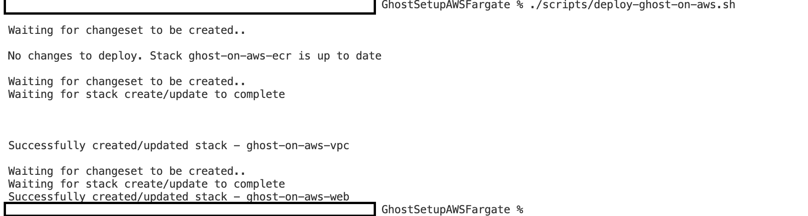
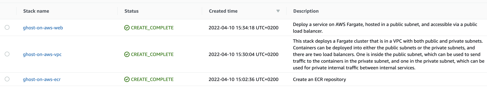
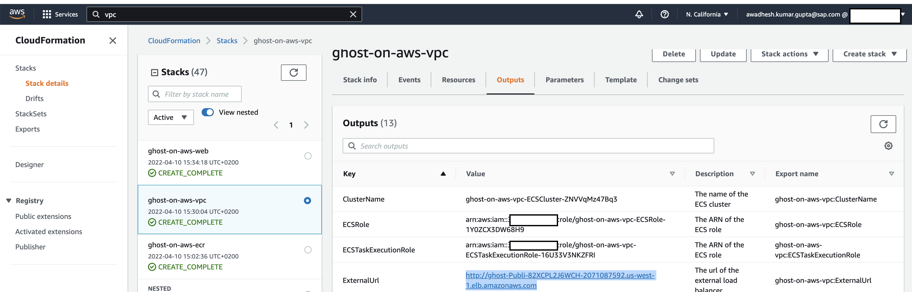
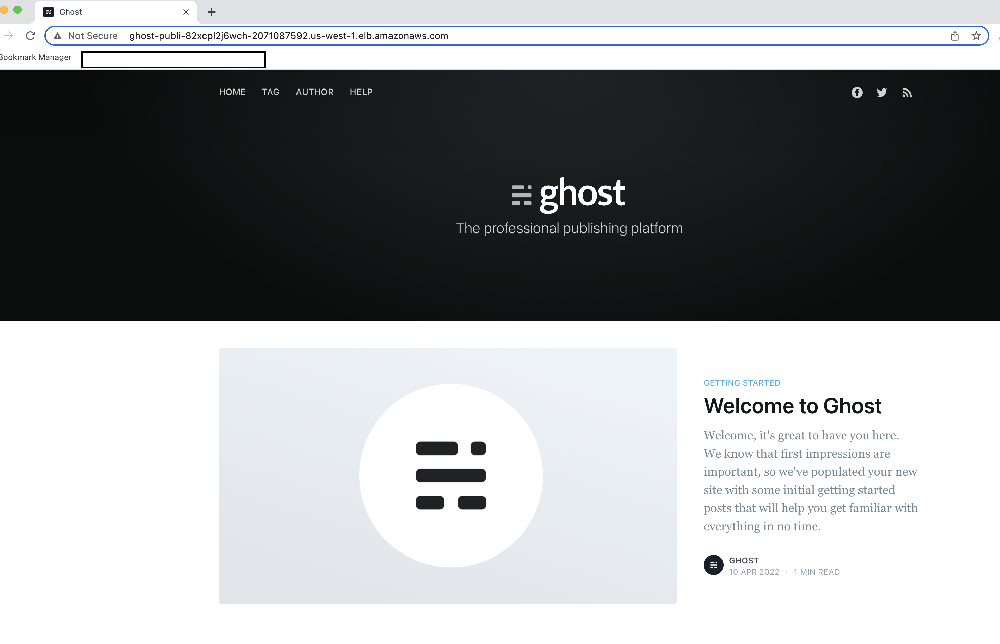

# Ghost Setup On Fargate

# Overview
Repository contains CloudFormation template and other resources to deploy Ghost blog stack in AWS Fargate.
 
 
 
Deploy Ghost service to the AWS cloud using AWS Fargate
1. Create ECR repository : 
    $ ECR_STACK_NAME="ghost-on-aws-ecr"
    $ REGION="us-west-1"
    $ TAGS="Project=DeployGhostOnAWS"
    $ aws cloudformation deploy --region=$REGION --stack-name="$ECR_STACK_NAME" --template-file=./infrastructure/ecr.yaml --tags=$TAGS --no-fail-on-empty-changeset

    
    
    

2. Build and deploy docker image
   $ chmod +x ./script/build-image.sh
   $ ./script/build-image.sh

    
    
    

3. Create VPC and deploy Ghost services
   $ ./scripts/deploy-ghost-on-aws.sh
   
    
    
    
    
    The template will create:

    one VPC,
    Two public subnet (To manage DR),
    Two private subnet (To manage DR),
    one InternetGateway (To have connectivity to internet with VPC),
    NatGateways (To communicate with private subnets to the internet via the public subnet),
    SecurityGroups,
    Elastic Load Balancers,
    IAM Role,
    
    Get The VPC external URL :

    
    
    # Finally Ghost homepage
    

To Do :
1. Add RDS instance to manage data externally.
2. Create CI pipeline starting with source GIT
3. Setting Monitoring stacks
    

*Reference 
https://docs.aws.amazon.com/AWSCloudFormation/latest/UserGuide/sample-templates-services-us-west-2.html
https://github.com/nathanpeck/aws-cloudformation-fargate

   

